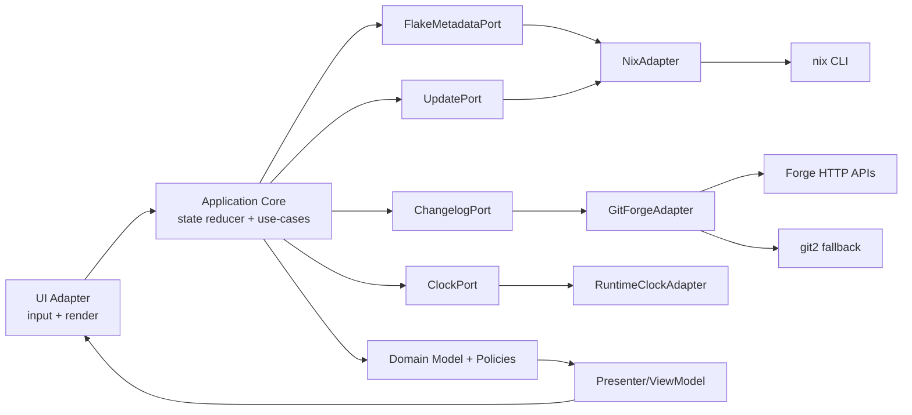

# Pure Architecture Rewrite Spec

Status: draft-ready
Type: architecture/refactor
Effort: XL (single PR)

## Problem

Current system is layered but not pure.

- App state depends on UI widget state (`ratatui::TableState`).
- Domain model owns presentation/time/protocol concerns (`display`, `Instant`, forge URL builders).
- App depends on concrete infra services.
- Integration tests mirror parser internals.

Result: weak boundary clarity, harder deterministic tests, slower safe change.

## Goal

Move to functional-core/imperative-shell.

- Pure core: deterministic, no IO/time/UI/framework deps.
- Impure shell: UI/input/runtime/adapters execute effects.
- Keep product behavior same (list/update/changelog/lock).

## Non-Goals

- No feature expansion.
- No UI redesign.
- No removal of nix/git API behavior.

## Pure Target Definition

Core modules must not depend on:

- `ratatui`, `crossterm`, `tokio`, `reqwest`, `git2`, `std::time::Instant`, process/network APIs.

Core modules may depend on:

- std collections/types, domain enums/structs, pure functions, typed errors.

## Target Architecture

## Boundary Rules

1. Domain owns semantics only, never formatting/transport/runtime expiry policy.
2. App core owns state machine + effect planning, never concrete adapters.
3. Adapters own IO + mapping from external formats to domain DTOs.
4. UI owns widget state and rendering only.
5. Dependency direction: adapters -> ports -> app/domain (inward).

## Required Refactors

### R1 - Purify domain models

- Move `UpdateStatus::display` out of `src/model/status.rs` into presenter module.
- Move `StatusMessage` expiry (`Instant`) out of model; keep pure message intent/severity only.
- Move forge URL construction out of `src/model/flake.rs` into adapter/policy module.

Files expected:

- Change: `src/model/status.rs`
- Change: `src/model/flake.rs`
- Add: `src/ui/presenter/*` (or `src/app/presenter/*`)
- Add: `src/service/policy/*` (or `src/model/policy/*` if pure)

### R2 - Remove UI framework leakage from app state

- Replace `TableState` in `ListState`/`ChangelogState` with pure cursor/selection primitives.
- Build `TableState` at render edge only.

Files expected:

- Change: `src/app/state.rs`
- Change: `src/ui/render/list.rs`
- Change: `src/ui/render/changelog.rs`

### R3 - Introduce ports and dependency inversion

- Define traits for metadata/update/changelog and optional clock.
- App depends on traits; default composition wires current adapters.
- Keep ergonomic constructor: `App::new(...)` + `App::new_with_ports(...)`.

Files expected:

- Change: `src/app/mod.rs`
- Add: `src/app/ports.rs`
- Change: `src/service/nix.rs`
- Change: `src/service/git.rs`
- Change: `src/service/mod.rs`

### R4 - Separate effect planning from effect execution

- Convert `execute_action` flow toward reducer pattern:
  - Single event type: `Event = UserAction | EffectResult | Tick`
  - input: `current state + Event`
  - output: `(new state, Vec<Effect>)`
- Runtime shell executes planned effects via ports.
- Reducer **never** directly calls ports.

Files expected:

- Change: `src/app/mod.rs`
- Add: `src/app/reducer.rs`
- Add: `src/app/effects.rs`

### R5 - Rebuild tests by seam

- Remove parser mirror in integration tests.
- Add domain tests (pure), reducer tests (deterministic), adapter tests (boundary/contract), end-to-end smoke.

Files expected:

- Change: `tests/integration_tests.rs`
- Add: `tests/domain_*`
- Add: `tests/reducer_*`
- Add: `tests/adapters_*`

## Single-PR Delivery Plan

Deliver `R1`-`R5` in one branch/PR, but execute in strict internal order to control blast radius.

### Checkpoint 1 - Domain + UI leak cleanup

- Apply `R1` + `R2` first.
- Keep behavior unchanged.

Must hold before moving on:

- `src/model/*` free of presentation/runtime expiry/transport URL policy.
- `src/app/state.rs` has no `ratatui` import.

### Checkpoint 2 - Ports + composition root

- Apply `R3`.

Must hold before moving on:

- `App` depends on traits, not concrete `GitService`/`NixService` fields.
- `src/main.rs` remains composition root for default wiring.

### Checkpoint 3 - Reducer/effects split

- Apply `R4`.

Must hold before moving on:

- Core transitions testable without runtime.
- Side effects represented as explicit effect enum.

### Checkpoint 4 - Test seam rewrite

- Apply `R5` last.

Must hold at PR completion:

- No parser mirror remains in `tests/integration_tests.rs`.
- Reducer tests cover load/refresh/update/changelog/lock transitions.

## Acceptance Criteria

Architecture:

- No framework/runtime deps in pure core modules.
- All outbound calls behind ports.
- UI widget state fully outside app core state.

Behavior:

- Existing workflows still pass: load, refresh, update selected/all, changelog, lock.

Quality:

- New tests by seam added.
- Existing integration coverage preserved or improved.

## Verification Plan

Commands:

- `nix develop -c cargo test`
- `nix develop -c cargo clippy --all-targets -- -D warnings`
- `nix develop -c cargo fmt -- --check`

Manual smoke:

1. Launch app against fixture flake.
2. Navigate list, select inputs, run update.
3. Open changelog for git input, lock commit.
4. Confirm status/help bars and transitions still correct.

PR gate:

- One PR only, but merge only when all checkpoints and verification pass.

## Risks and Mitigations

- Risk: over-refactor stalls delivery.
  - Mitigation: phase gates with strict exit criteria.
- Risk: behavior regressions in async flows.
  - Mitigation: reducer tests + smoke checklist per phase.
- Risk: trait abstraction leaks complexity.
  - Mitigation: keep port surface narrow; avoid generic over-design.

## Alternate Pure Strategies

1. Strict hexagonal now: fastest purity, highest churn/risk.
2. Incremental thin ports first (recommended): slower purity, lower risk.
3. Vertical slice migration: purity per use-case, medium coordination cost.

Recommended: option 2.

## Work Breakdown (ordered)

1. Purify model status + forge policy extraction.
2. Remove `TableState` from app state.
3. Add ports + app DI constructor.
4. Add reducer/effects split.
5. Rebuild tests by seam.

## Out of Scope Tracking

- CLI flags changes
- release pipeline changes
- non-boundary UI polish

## Open Questions

- Should `ClockPort` be introduced in checkpoint 1 or checkpoint 3?
- Where should presenters live: `app/presenter` or `ui/presenter`?
- Keep `App::new` concrete for binary only, or expose only `new_with_ports` in lib API?
